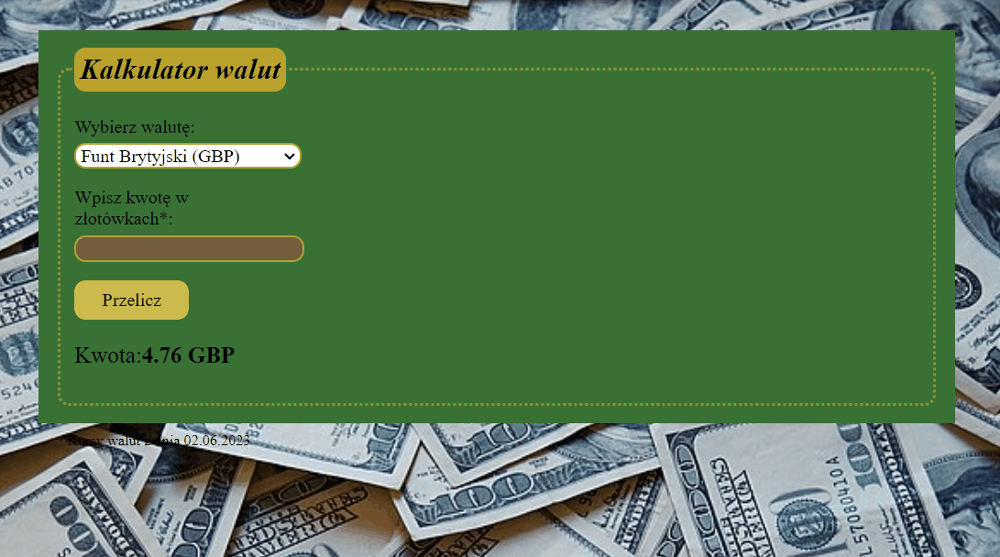

# Currency converter

Hi! This is a simple currency converter which I created as a part of coding course where I learning forms in Java Script.

The user can choose from following currencies: PLN, EUR, GBP, CHF and USD.
Besides technologies i showed below, i used: BEM, JavaScript ES+6, and normalize.css. That helps me make my project more responisve and clearly.

## Demo

[https://dawidklusak.github.io/currency-converter/](https://dawidklusak.github.io/currency-converter/)

## Preview

When you write a amout in polish zloty in input and press a beige button "Przelicz" you get how much money you should get in chosen currency.
Keep it simple.

## Technologies
Project is created with:

